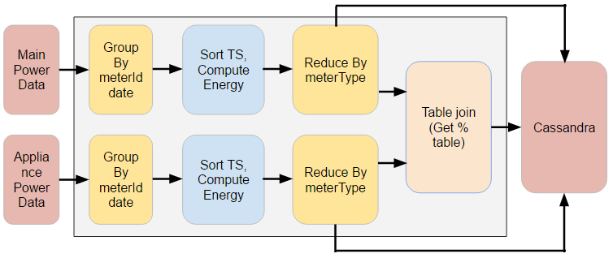
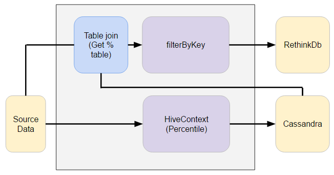
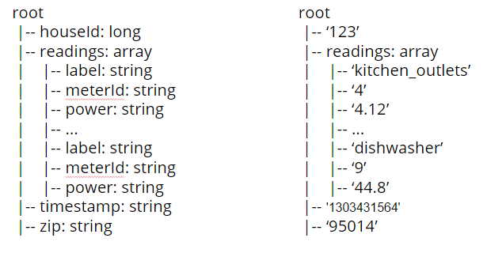
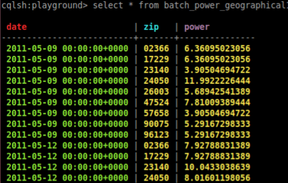
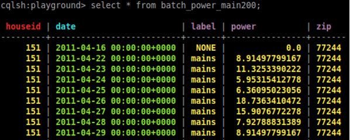
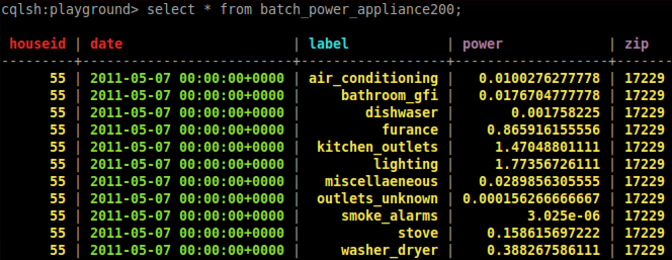

# Smart Meter Watchdog project in Insight Data Engineer program
(ongoing)

## Introduction
Smarter Meter Online is a "hypothetical" system to monitor home energy consumption. The idea of the project is to attach power sensor to all the major appliances around the home, and the system can monitor/alert energy consumption in details. It takes in real time data feeding (engineered), and builds data pipeline to generate home energy usage dashboard and detailed appliance energy usage. In addition, it also detects sudden spike in the power reading from any meter.

## Data Sources
The raw data is [The Reference Energy Disaggregation Data Set](http://redd.csail.mit.edu/) from MIT. It has 6 houses available for download, and has a range of ~30 days each. This project uses it as source data and generate more houses featured random spike and scaling. The original data looks like the following (Basicall each record contains (timestamp, powerReading) pair):

In the batch layer of processing, there are 200GB data being generated with these data sources and sent to the data pipeline. It contains about 600 million records in total.

## Data pipeline:
The data pipeline is shown as the following figure:

I choose Kafka because it is fault tolerant and is able to buffer the data for some time and can support different types of consumers. Camus is used as the tool to read the data from Kafka and write to HDFS. 

The data processing part contains two portions, one is the batch layer processing, which contains computing the daily energy consumption for each appliance as well as the main power. The data processing pipeline is implemented in Spark (pyspark). It also uses hivecontext to compute the 97% percentile for each meter and use in the real time layer. The results from Spark processing are written to Cassandra database to serve the Flask UI.

The real time layer is processed in Spark Streaming, it reads in the statistics data from Cassandra, and filter the streaming power from all appliances , then add some threshold to determine if there is any power overshoot (sudden excessive power reading). It generates alerts if there are power overshoot and write the records into rethinkDb and push to Flask UI

## Data Processing

The data processing pipeline in batch layer is shown in the following figure:

The energy consumption calculation follows the following equation:

The data processing pipeline in real time layer is shown in the following figure:

## Schemas

The source data schema is shown in the following figure:

The Cassandra database has three schemas for different purpose:

The schema to serve the geographical study is in the following figure:

The schema to serve the home historical energy consumption study is in the following figure:

The schema to serve the home appliance energy study is in the following figure:

