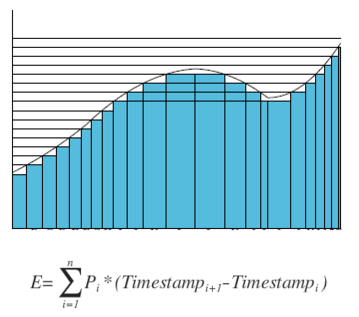

# Smart Meter Watchdog project in Insight Data Engineer program

## Introduction
Smarter Meter Online is a "hypothetical" system to monitor home energy consumption. The idea of the project is to attach power sensor to all the major appliances around the home, and the system can monitor/alert energy consumption in details. It takes in real time data feeding (engineered), and builds data pipeline to generate home energy usage dashboard and detailed appliance energy usage. In addition, it also detects sudden spike in the power reading from any meter.

## Data Sources
The raw data is [The Reference Energy Disaggregation Data Set](http://redd.csail.mit.edu/) from MIT. It has 6 houses available for download, and has a range of ~30 days each. This project uses it as source data and generate more houses featured random spike and scaling. The original data looks like the following (Basicall each record contains (timestamp, powerReading) pair):

In the batch layer of processing, there are 200GB data being generated with these data sources and sent to the data pipeline. It contains about 600 million records in total.

## Data pipeline:
The data pipeline is shown as the following figure:

I choose Kafka because it is fault tolerant and is able to buffer the data for some time and can support different types of consumers. Camus is used as the tool to read the data from Kafka and write to HDFS. 

The data processing part contains two portions, one is the batch layer processing, which contains computing the daily energy consumption for each appliance as well as the main power. The data processing pipeline is implemented in Spark (pyspark). It also uses hivecontext to compute the 97% percentile for each meter and use in the real time layer. The results from Spark processing are written to Cassandra database to serve the Flask UI.

The real time layer is processed in Spark Streaming, it reads in the statistics data from Cassandra, and filter the streaming power from all appliances , then add some threshold to determine if there is any power overshoot (sudden excessive power reading). It generates alerts if there are power overshoot and write the records into rethinkDb and push to Flask UI

## Data Processing

The data processing pipeline in batch layer is shown in the following figure:

The energy consumption calculation follows the following equation:

In the data processing pipeline, Spark first expand the compact JSON into records (~20 meters in one JSON records to ~20 JSON records). Then aggregate the records by houseId, meterId and Date. For each aggregation, it sorts the timestamp and compute the timestamp difference in adjacent records, them multiply the power reading. All the results are summed up to get energy consumption for a single house/meter/date. The appliance energy calculation are joined with main energy calculation to generate % for each appliance type.

The data processing pipeline in real time layer is shown in the following figure:

## Schemas

The source data schema is shown in the following figure:

The readings from all the appliance meters (~20 for each house) are encoded into 1 JSON file so that records could be pushed to Kafka faster. This would be expanded in Spark in both the batch layer and real time layer.

The Cassandra database has three schemas for different purpose:

The schema to serve the geographical study is in the following figure:

This table has date as partition key and zip as clustering key so that each zip for each date will have one overall reading. And data from one date will be on the same Cassandra node to improve read performance.

The schema to serve the home historical energy consumption study is in the following figure:

This table has houseid as the partition key and date as the clustering key. The schema is designed in a way that for each house, energy consumption from all dates would be on the same node to improve read performance

The schema to serve the home appliance energy study is in the following figure:

This table has (houseid, date) as composite partition key so that all the appliance energy for each house and date will be on the same Cassandra node to improve read performance

## Usage:

### Data cleaning (This would remove unclean timestamps from all the readings):
cd utils

python FindCleanDays.py /home/ubuntu/project/SmartMeterWatchdog/data/low_freq/house_1 "04/19/2011:00:00:00"

### Generate 30 day reading data as raw source:
cd utils

python generateData.py ../data/low_freq/house_1 20

The previous two steps can also be run as following:
cd utils

./genall.sh

### Batch layer:
To run batch layer job:

cd batch

spark-submit --master spark://<SPARK_IP>:7077 --executor-memory 14000M --driver-memory 14000M batch.py

### Real time layer:
To run real time layer job:

cd streaming

park-submit --packages org.apache.spark:spark-streaming-kafka_2.10:1.5.1 --master spark://<SPARK_IP>:7077 smw_stream.py "<AWS_DNS>:9092"

### To run Kafka producer:
cd kafka

python KafkaLfProducer.py /home/ubuntu/project/SmartMeterWatchdog/config/smw.cfg <kafka public ip> 0 <startHouseId> <endHouseId> houseStatus
